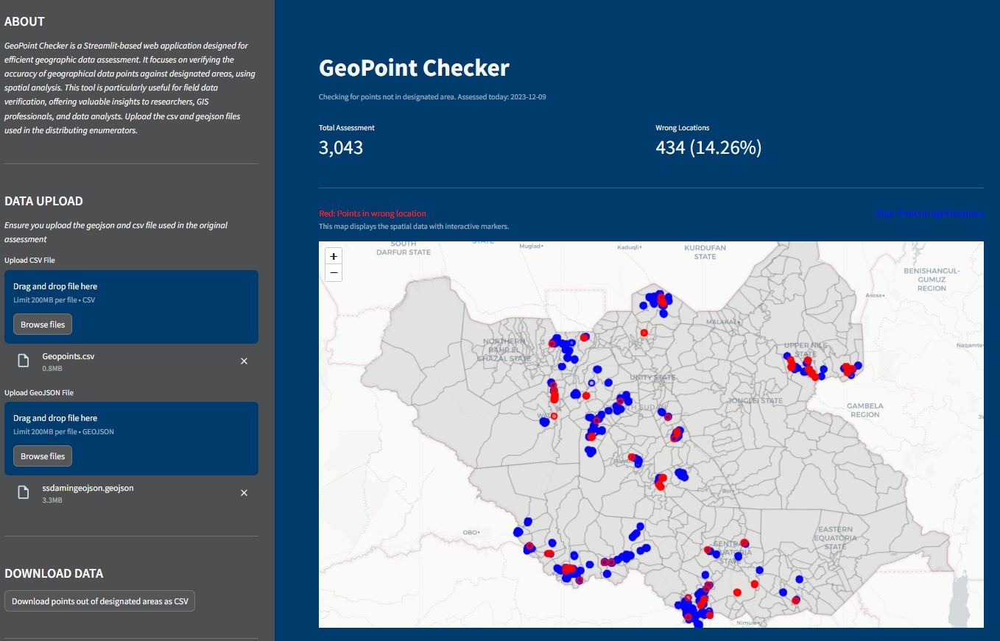

Certainly! Here's the syntax for the README in Markdown format:

# GeoPoint Checker: Streamlit Application

GeoPoint Checker is a Streamlit-based web application designed for efficient geographic data assessment. It focuses on verifying the accuracy of geographical data points against designated areas, using spatial analysis. This tool is particularly useful for field data verification, offering valuable insights to researchers, GIS professionals, and data analysts.




## Features

- **Data Upload**: Ability to upload CSV and GeoJSON files for data analysis.
- **Spatial Analysis**: Conducts spatial joins and assessments to determine the accuracy of data points in relation to specified geographic boundaries.
- **Interactive Mapping**: Utilizes Folium for generating interactive maps to visualize data points.
- **Data Metrics**: Calculates and displays important metrics like the total number of assessments, the number of incorrectly placed points, and their percentage.
- **Downloadable Data**: Offers functionality to download a CSV file of points identified as out-of-bounds.
- **Customized User Interface**: Provides a clean and user-friendly interface with customized Streamlit settings.
- **Documentation and Help Section**: Includes sections for application description, user guidance, and additional documentation.

## Installation

To run this application, you need to have Python installed on your system along with the necessary libraries. Follow these steps to get started:

1. Clone the repository or download the source code.
2. Install the required libraries using the command:
   ```
   pip install -r requirements.txt
   ```
3. Run the application:
   ```
   streamlit run pointChekerStreamlit.py
   ```

## Usage

After launching the application, follow these steps:

1. **Upload Data**: Use the sidebar to upload your CSV and GeoJSON files.
2. **View the Map**: The map will automatically update to display the points from your uploaded files.
3. **Analyze Data**: Observe the color-coded data points for quick assessment (blue for correct, red for incorrect).
4. **Download Data**: Download a CSV file of the incorrectly placed points for further analysis.
5. **Explore Metrics**: Check the automatically updated metrics for a quick overview of the dataset's accuracy.

## License

This project is licensed under the [MIT License](LICENSE.txt).

## Support and Contact

For support, feature requests, or any other inquiries, please contact [orenaiket@yahoo.com].
