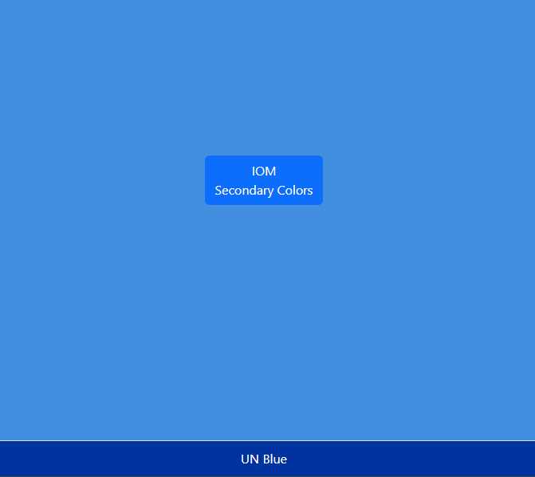

# OPPWeek
One Mini Project per week until December
Certainly! Below is a simple README for your mini color changer project:

Link to live: https://otomisin.github.io/OPPWeek/
---
https://otomisin.github.io/OPPWeek/

# Color Changer Web App

A simple web application that changes the background color of the page when a button is clicked. Users can also see the name of the current color displayed in a footer.


## Features

- A button that, when clicked, changes the page's background color.
- A rotating selection of colors: UN Blue, Yellow, Mint Green, Orange, and Red.
- Display of the color's name in the footer.

## Setup and Installation

1. Clone this repository to your local machine:
   ```bash
   git clone https://github.com/otomisin/color-changer.git
   ```
   Replace `your-username` with your GitHub username and `color-changer` with the repository name if it's different.

2. Open the `index.html` file in a web browser.

3. Click the button to change the background color and see the name of the color in the footer.

## Technologies Used

- HTML
- CSS
- JavaScript
- Bootstrap 5

## Contributions

Pull requests are welcome! For major changes, please open an issue first to discuss what you'd like to change.

## License

MIT

---